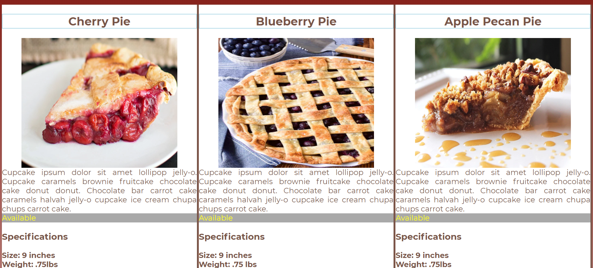

# Product Cards

## Description
This project allows viewers to see available pies for sale.  Each pie has an image, description, availability, size, weight, and price included.
## Screenshots

## How to Run
1. Clone down this repo
1. Make sure you have  http-serve installed via npm. If not, get it [HERE](https://npmjs.com/package/http-server).
1. On your command line run `hs -p 9999`
1. In your browser go to `http://localhost:9999`